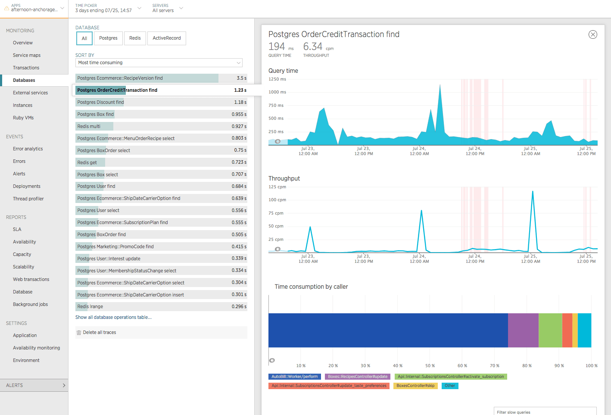
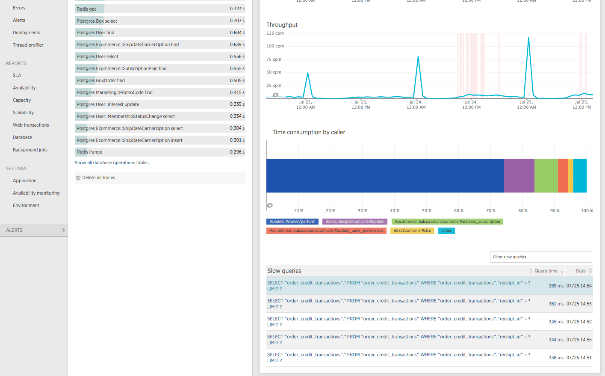
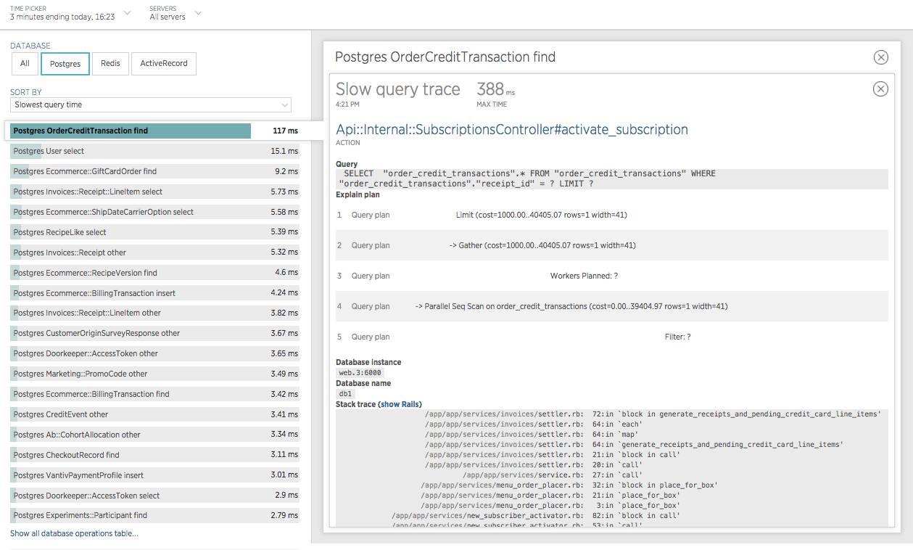
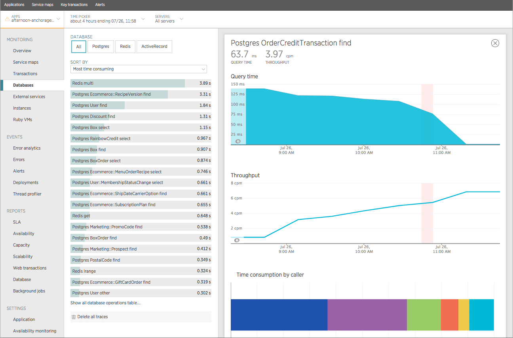
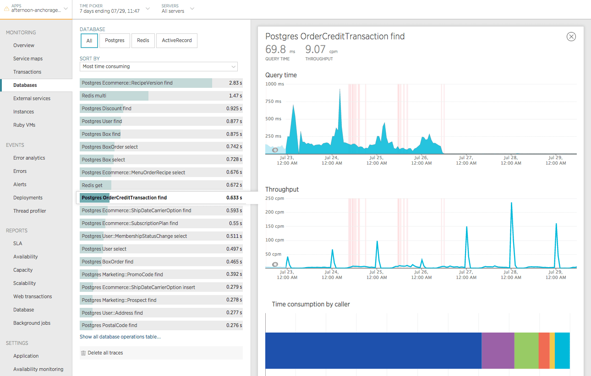

## Tìm và sửa các index bị thiếu trong ứng dụng Rails

Khi nhìn vào "thời gian tiêu tốn nhiều nhất" hoạt động của cơ sở dữ liệu của chúng tôi ở New Relic và tôi bắt gặp một cái gì đó trông có vẻ kỳ lạ đối với tôi.

Nhìn vào danh sách, tôi nhận thấy có hai thao tác mà tôi không ngờ là tốn nhiều thời gian nhất là `OrderCreditTransaction find` và `Discount find`.

Trong bài này, chúng ta sẽ đi sâu vào `OrderCreditTransaction find` để tìm vấn đề và sửa nó.


### "Thời gian tiêu tốn nhiều" nhất nghĩa là gì?
"Thời gian tiêu tốn nhiều" cho bạn biết tổng thời gian đã dành để thực hiện một thao tác trong một phút. Điều này tương đương với thông lượng trung bình (số lần gọi / phút) nhân với thời gian phản hồi trung bình.

Ví dụ nếu `User find` có thời gian phản hồi trung bình là 4.71 ms và thông lượng trung bình là cpm (call per minute) thì nó sẽ tiêu thụ: 4.71 ms * 743 cpm = 3.5 s.

Vì vậy, điều này có nghĩa là trong số tất cả các hoạt động cơ sở dữ liệu, ứng dụng của chúng tôi đang dành nhiều thời gian thứ hai cho `OrderCreditTransaction find`. Và để xảy ra trường hợp đó, nó được gọi với số lượng lớn, có thời gian phản hồi chậm hay kết hợp 2 điều đó với nhau.

Hãy cùng đào sâu và tìm hiểu.


## Xác định vấn đề
Trước tiên, hãy xem thao tác cơ sở dữ liệu `OrderCreditTransaction find`. Khi kiểm tra hoạt động này, bạn sẽ nhận thấy nó có thông lượng tương đối thấp (~ 6,34 cpm) và thời gian phản hồi trung bình khá chậm (~ 196 mili giây).

Điều này dường như chỉ ra rằng vấn đề có thể liên quan đến thời gian phản hồi chứ không phải thông lượng.

Hãy cuộn xuống và xem một số truy vấn chậm là gì…


Thật thú vị! Nó trong như có vài câu truy vấn đơn giản sử dụng `SELECT` lọc theo `receipt_id` đang chiếm gần như 400ms! Điều đó có vẻ như chúng tôi có thể là thiếu một vài index... Hãy xác minh bằng cách nhấp vào một trong những "Slow queries" và nhìn vào `EXPLAIN`

Nếu chúng ta nhìn vào dòng 4 của `Explain` chúng ta có thể thấy rằng Postgres đang thực hiện một Parallel Sequential Scan trên bảng `order_credit_transactions`, điều này có nghĩa là trước khi truy vấn này trả về kết quả nó phải thực hiện tìm kiếm trên từng bản ghi trong bảng (tại thời điểm bài viết là 3,320,909 bản ghi). Điều này giúp chúng tôi xác nhận giả thuyết là bị thiếu index.

Bây giờ, hãy xem codebase của chúng tôi và xác minh rằng chỉ mục bị thiếu.

```ruby
create_table "order_credit_transactions", force: :cascade do |t|
  t.integer  "order_id"
  t.integer  "receipt_id"
  t.datetime "created_at",                     null: false
  t.datetime "updated_at",                     null: false
end
```

Aha! Nó trong như ko có index trên cột `receipt_id`

Lý tưởng, tại thời điểm này (trước khi chúng tôi thêm bất kì index nào mới) chúng tôi muốn xác nhận về hành vi chúng tôi thấy từ `EXPLAIN` từ New Relic trên máy local cá nhân để chúng tôi có thể hiểu về query plan thay đổi khi thêm index mới.

Chúng tôi có thể làm điều này bằng cách mở rails console và chạy câu lệnh:

```ruby
OrderCreditTransaction.where(receipt_id: 1).explain
```
Nó sẽ chạy `EXPLAIN` query trên database local.

Tuy nhiên, có một vấn đề với điều này. Chạy câu lệnh này dưới môi trường local có thể cho chúng tôi kết quả với ý nghĩa khác với những gì chúng tôi thấy trên môi trường production, điều này là bởi vì Postgres tạo query plan một cách động và phụ thuộc vào vài yếu tố, một vài yếu tố đó khác nhau giữa môi trường production và local (đáng chú ý nhất là số lượng bản ghi của các bảng)

Để giải quyết vấn đề này, chúng tôi có thể mất một chút thời gian để sao chép một số dữ liệu liên quan từ production vào máy local của chúng tôi và sau đó chạy `EXPLAIN`. Nhưng trong trường hợp này chúng tôi rất chắc chắn rằng đây là vấn đề nên nỗ lực liên quan đến việc đó là không đáng.


## Giải quyết vấn đề
Bây giờ, hãy thêm index bị thiếu và đảm bảo rằng chúng tôi thực hiện đồng thời để chắc chắn bảng bị ảnh hưởng đến hiệu suất ở mức tối thiểu hoặc không có trong khi index đang được tạo.

Rails ko cũng cấp một cách rõ ràng để tạo migration để thêm index vào một cột có sẵn một cách đồng thời, nên chúng tôi cần thực hiện 3 bước.

Đầu tiên, chúng tôi tạo một migration trống, sau đó chúng tôi chỉnh sửa migration theo cách thủ công như được nêu bên dưới và cuối cùng chúng tôi chạy migration, commit và deploy.


```bash
$ bin/rails g migration AddIndexToOrderCreditTransactions
```

```ruby
class AddIndexToOrderCreditTransactions < ActiveRecord::Migration[5.0]
  disable_ddl_transaction!

  def change
    add_index :order_credit_transactions, :receipt_id, algorithm: :concurrently
  end
end
```

```bash
$ bin/rails db:migrate
```

## Xác minh bản sửa lỗi
Sau khi code được merge và chạy migration trên môi trường staging và production hãy chắc chắn là chúng tôi đã khác phục được vấn đề.



Woah! Có vẻ như nó đã hoạt động. Sau khi deploy thời gian truy vấn trung bình giảm từ thời gian phản hồi trung bình ~ 196 ms xuống ~ 1 ms. Nghĩa là thời gian phản hồi giảm 99,49%!

Cuối cùng, hãy theo dõi một vài ngày sau khi triển khai để đảm bảo rằng mọi thứ vẫn hoạt động tốt.



Nó vấn hoạt động tốt!

Ref: https://scottbartell.com/2021/02/24/finding-and-fixing-missing-indexes-in-a-rails-app/
